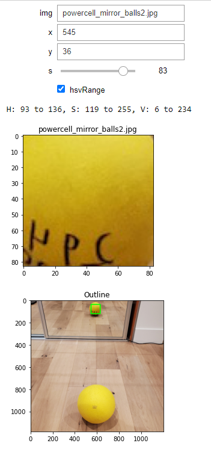

# imageWindowMaker

Update: new file, autoColorFinderWithoutWidgets.ipynb, is a prototype program that automatically outlines shapes it discovers inside of an image and assigns a number to it. Initializing the INDEX variable as one of the numbers of the shapes, after running the kernel, will print two lines of python that are variables containing an array of the lower and upper range of HSV the selected shape. ipywidgets not needed for this program.

**UPDATE: autoColorFinderWithoutWidgets.ipynb now works fairly effectively**

**Installation for ipywidgets unecessary for the automatic version ^**


Before using make sure to install ipywidgets using anaconda:

```console
conda install -c conda-forge ipywidgets
```

or using pip:

```console
pip install ipywidgets
jupyter nbextension enable --py widgetsnbextension
```

By running all the cells (last one not needed), you can use two text inputs to specify the top-left corner x-and-y coordinates of a small square that can be used to find the HSV Color Range, or the highest and lowest values inside of each Hue, Saturation, and Value values inside of that small image. The size of the window can be adjusted using a slider that specifies the length of one side of the square. Use the first text input to specify the path to the image you want to look at.

Download the project and add the jupyter notebook file to the same folder where the image you want to look at is located.


